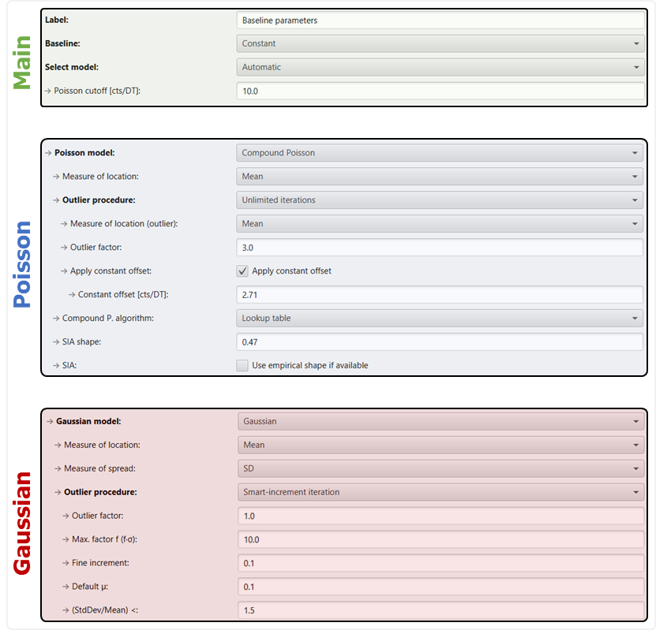

# Methods and submethods

!!! tldr "Key concepts"

    1. Data generation and analysis in spTool are structured into methods and submethods.
    2. A method contains all instructions that tell spTool how to process raw data.
    3. Methods are stored in a single file which can be indentified by their file type `.spm`. Method files can easily be saved, reloaded and shared.
    4. You can share these files with collaborators or include them in a publication's supplementary data to make harmonisation and comparison of analysis strategies easier.
    5. By default, method files are kept in the user folder: (typically: `C:\Users\USERNAME\spTool3\user\methods`).

## 1. Create a method: Method editor

To create a method, open the method editor by selecting `MET` in the graph selection section of the main window. This
puts the method editor in the centre view of the window:

{: width="600" style="display: block; margin: 0 auto;"}

A method contains submethods with instructions for each processing step. A detailed list of these steps is
provided below. For a quick start, click on the central `Quick start new method` button to create a new method.

You can also drag & drop an .spm file into spTool to load it. For exmample, uses these files.

- **A**: Symbol indicates if the method has changed since the last time you saved it.
- **B**: `Save`: Overwrites the file that the method has been saved as.
- **C**: `Save as`: Opens a file explorer window to let you save the method as a new file. This keeps the previous file
  unaltered.
- **D**: Resets the method to the state of the last time it was saved.
- **E**: Reloads the 'default' method. You can set a default method in the configuration via `Edit` > `Configuration` >
  `Current method`.
- **F**: `Delete`: Deletes the current method file by moving it into the 'recycle' folder in your user directory (
  typically: `C:\Users\USERNAME\spTool3\user\methods_recycled`).
- **G**: Open a popup window to quickly find and load a method from your user directory (typically:
  `C:\Users\USERNAME\spTool3\user\methods`). The user directory serves as a storage place for your methods. When
  downloading a new version of spTool, it will find existing methods automatically. Hint: The **right click menu**
  offers additional features:
    - delete method (see **F**)
    - add highlights as a bookmark.
- **H**: Alternatively to the library popup (**G**), you can open a file browser to load method files.
- **I**: Creates a new method.
- **J**: Save the current method into the current project folder. You can set the current project directory via `Edit` >
  `Configuration` > `Project path`. The project directory is the location on your system where spTool will try to store
  and load projects (see explanation on the `File` menu in section 1.1). If your method is highly specific to a certain
  project,
  you can use this button to save it in the same folder.
- **K**: Loads a method from the current project folder. You can set the current project directory via `Edit` >
  `Configuration` > `Project path`. The project directory is the location on your system where spTool will try to store
  and load projects (see explanation on the `File` menu in section 1.1).
- **L**: Submethods are executed in the order that they are listed. Use this button to move a submethod **up**.
- **M**: Submethods are executed in the order that they are listed. Use this button to move a submethod **down**.
- **N**: Creates a new submethod.
- **O**: Add an existing submethod from the submethod library (see `Edit` > `Submethod editor`).
- Use the **right click menu** to further organise submethods:  
  {: width="200" style="display: block; margin: 0.5em auto 0.5em auto;"}
    - `Add to library`: Adds the selected submethods to the submethod library (see `Edit` > `Submethod library`).
    - `Clone`: Creates and adds a copy of the selected submethod.
    - `Remove`: Removes the selected submethods from the method.
    - `Override defaults in submethods`/`Reset submethods`: You can set a 'default' state of your submethod via
      `Override defaults in submethods`. When you click on it, the submethod sets its current settings as its default.
      Use `Reset submethods` to reset the selected submethods to the default settings. This can be helpful when you try
      to optimise a method and vary parameters frequently. Alternatively, you can use button **D** to reset the whole
      method to its 'last saved' settings.

## 2 Available submethods:

**To see all options in the submethods, make sure to activate the 'Expert mode' via `Edit` >
`Configuration` > `Expert mode`.** Else, you will be shown the lightweight version that only lists the most important
options. In the background, the non-expert options are applied during processing with the respective value that is set
in the submethod!

- #### `Csv import parameters`:
  Define how csv files are read. Note: spTool will use this submethod if you tell it to do so
  in the configuration: `Edit` > `Configuration` > `Import submethod` or else it will prompt you to input the import
  parameters with each new import.

- #### `Nu import parameters`:
  Define how Nu TOF data are read. Here you can also select which isotopes to load. Note: spTool
  will use this submethod if you tell it to do so in the configuration: `Edit` > `Configuration` > `Import submethod` or
  else it will prompt you to input the import parameters with each new import.

- #### `Data generator main parameters`:
  This submethod is required to generate in-silico data. It contains parameters that
  describe the 'synthetic' sample (see *spTool: An interactive software to generate and navigate in-silico single
  particle data from ICP-QMS and ICP-TOFMS instruments*
  [https://doi.org/10.26434/chemrxiv.15004857/v1](https://doi.org/10.26434/chemrxiv.15004857/v1))

- #### `Particle population parameters`:
  At least one instance of this submethod is required to generate in-silico data. It
  contains parameters that describe an in-silico particle population (see *spTool: An interactive software to
  generate and navigate in-silico single particle data from ICP-QMS and ICP-TOFMS
  instruments*  [https://doi.org/10.26434/chemrxiv.15004857/v1](https://doi.org/10.26434/chemrxiv.15004857/v1))

- #### `Signal modification parameters`:
  Submethod for mathematical modification of signal, e.g., sum the signal of all isotopes of an element.

- #### `Time region`:
  Submethod to select a time region of the sample (or to reset the sample to its original full time range).

- #### `Baseline parameters`:
  Baseline parameters tell spTool how to estimate the baseline. The baseline is a statistical model of the
  background signal. The Search submethod uses the baseline to compute detection thresholds, i.e., critical limits.
    - **The Baseline submethod is required to search for events** (see Search submethod).
    - In the submethod list, the **Baseline parameters must be positioned before the Search parameters**.
    - You can **only** use **1** Baseline submethod per method.
    - The baseline method does not set the threshold! The significance levels only apply to the outlier removal
      procedure (see *Deep Dive*).
   <!-- @formatter:off -->
    !!! abstract "Deep Dive"
         The Baseline parameters have 3 groups of parameters:
  
         **Main**: 
         Decide whether the baseline is calculated as a **constant** or **dynamic** threshold. 
         Dynamic thresholding is essential for samples with drift. Decide how the statistical **distribution** is selected. 

         For the distribution, there are two cases to distinguish:
         
         **1) Poisson**: the Poisson distribution is the best choice for low signal intensities.
         
         **2) Gaussian**: the Gaussian ('Normal') distribution often works better at high signal intensity
         since it can capture overdispersion better than Poisson.
         
         The Baseline parameters do not set the detection threshold. 
         Instead, their task is to desribe the background signal as accurately as possible.
         Take a look at the following examplie for a Gaussian distribution: To compute the **detection threshold**,
         a Gaussian distribution model requires a mean and standard deviation (SD) of the background signal.
         The raw data, however, consist of background and particle signals. 
         This means that it is not valid to use the raw data mean and SD to describe to background. 
         The presence of particle signals will bias the mean and SD to larger values.
         Typically, this issue is solved by iteratively removing the signals 
         associated with events to obtain a good estimate of the background mean and SD.
         This procedure is similar to an **iterative outlier removal** where the event signals are the outliers.
         The baseline parameters specify how this outlier removal is executed.
         
         A detailed explanation can be found in the article [Elinkmann et al. 2023 in JAAS](https://doi.org/10.1039/d3ja00292f),
         which is available as a PDF [here](https://www.icpms.com/files/publications/2023_Elinkmann_JAAS.pdf).
         {: width="800" style="display: block; margin: 0.5em auto 0.5em auto;"}

         Which questions likely require your attention?

         **Main**
         
         `Baseline`: Make sure to select `Dynamic` when you know that there is drift.
         
         **Poisson**
         
         `Poisson model`: Make sure to select `Compound Poisson` for ICP-TOFMS data.
         For quadrupole MS, use one of the other options. Details are explained [here](https://doi.org/10.1039/d3ja00292f).
         
         `SIA shape`: The shape factor of the single ion area (SIA)
         is an important parameter for the intrinsic noise of the TOF detector as described by 
         [Lockwood et al.](https://doi.org/10.1039/D5JA00230C), 
         [Hendriks et al.](https://doi.org/10.1039/c9ja00186g) and
         [Gundlach-Graham et al.](https://doi.org/10.1021/acs.analchem.2c05243)
         If you know the SIA shape factor make sure to set the correct value. 
         Otherwise, use the checkbox `Use empirical shape if available`, 
         which tells spTool to estimate the SIA shape from the data. spTool reports the results in the results table (`TAB`).

- #### `Search parameters`:
  This submethod tells spTool how to search for events. *This method controls the detection
  threshold* (see `highlight box A` below). It uses the statistical model of the background provided by the baseline.
  For the detection threshold (i.e., the `Event height filter`), you can set the one-sided alpha error (Type I error
  probability) as α (`highlight box A`: typically 1E-6) or via the corresponding z-factor (as in z·σ, `highlight box B`:
  typically z = 3.29).
  {: width="350" style="display: block; margin: 0.5em auto 0.5em auto;"}
  **Hint**: Each search submethod creates a new population. You can add more than one search submethod with different
  parameters, e.g., optimised to get the best data on particle number and particle size. For that, each search
  submethod creates a new branch. All subsequent operations, e.g., Gating, Filters and Align, are applied to that
  branch. When you add a new search submethod, you start a new branch and the previous Gating, Filter, ... submethods do
  not apply to the new branch (i.e., you have to add them).
  {: width="215" style="display: block; margin: 0.5em auto 0.5em auto;"}

- #### `Align isotopes parameters`:
  For TOFMS data, this method is used to align events across multiple channels (mz,
  isotopes). Typically, this method is required for composition analysis unless the search handles alignment by
  itself! Note: Once the isotopes are aligned, you cannot use Gating or any Filter other than 'Aligned filtering'.
  **Thus, it is recommended to filter the data properly first and then align.**

- #### `Gating parameters`:
  This submethod includes options to remove events based on certain peak properties such as 'Number
  of points', 'Area', 'Height'.

    <!-- @formatter:off -->
    !!! abstract "Deep Dive"

        **The peak height-based gating filter is somewhat redundant with the search height
        specified in the search method.** Why does spTool provide two options?

        The idea is that the search submethod assumes *sane statistical conditions*, i.e., 
        the background signal is well described by the statistical model, e.g., a Gaussian or Poisson distribution.
        This assumption can, however, quickly be violated. Example: When there is small particulate contamination,
        the baseline may not purely consist of 'ionic' species. Especially for the Poisson distribution,
        which does not take the empirical standard deviation into account but only the mean ionic signal,
        such presence of 'unknown particulate dirt' will likely render the critical limit estimation rather unreliable.
        As described in the 2023 JAAS paper [https://doi.org/10.1039/d3ja00292f](https://doi.org/10.1039/d3ja00292f),
        this mismatch between statistical model and reality often manifests in an excess of false-positive event detections.
        In response, users tend to increase the threshold by choosing extremely high z-values with z > 5 (z as in z·σ,
        i.e., 5·σ). However, these large z-values are not really justified from the statistical point of view. They rather
        indicate that the statistical model does not match the experimental data very well. Instead, the 2023 JAAS paper
        proposes a different approach where the detection limit (according to Currie's formalisms) is multiplied with a
        factor (typically f = 2) to avoid implausible z-factors beyond z = 5. The Gating submethod allows this procedure,
        which is not based on pure statistics but represents a solid numerical approximation (and thus not shown in the
        `Search parameters` submethod).
        
        *Keep in mind that this approach is rather a 'last resort' measure*.
        {: width="650" style="display: block; margin: 0.5em auto 2em auto;"}

- #### `Filter parameters`:
  The filter submethod provides further options to remove events, e.g., peak coincidence as
  described in Elinkmann and Kronenberg et al.
  [https://doi.org/10.1016/j.talanta.2026.129835](https://doi.org/10.1016/j.talanta.2026.129835) or over-range
  events, and 'regions of interest' (ROI) in the intensity data.

- #### `Remove isotopes parameters`:
  This submethod allows you to remove isotopes with too few or too many events or too
  little intensity. Consider putting this submethod before the `Align isotopes parameters` submethod to keep 'bad
  isotopes' out of subsequent cluster analyses.