# 1. Start spTool

Upon startup, you may start a lightweight version as a **data generator** only.
For the full version including analysis capabilities select **analyser**.

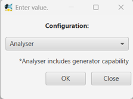{: width="150" }

# 2. Overview: spTool main screen

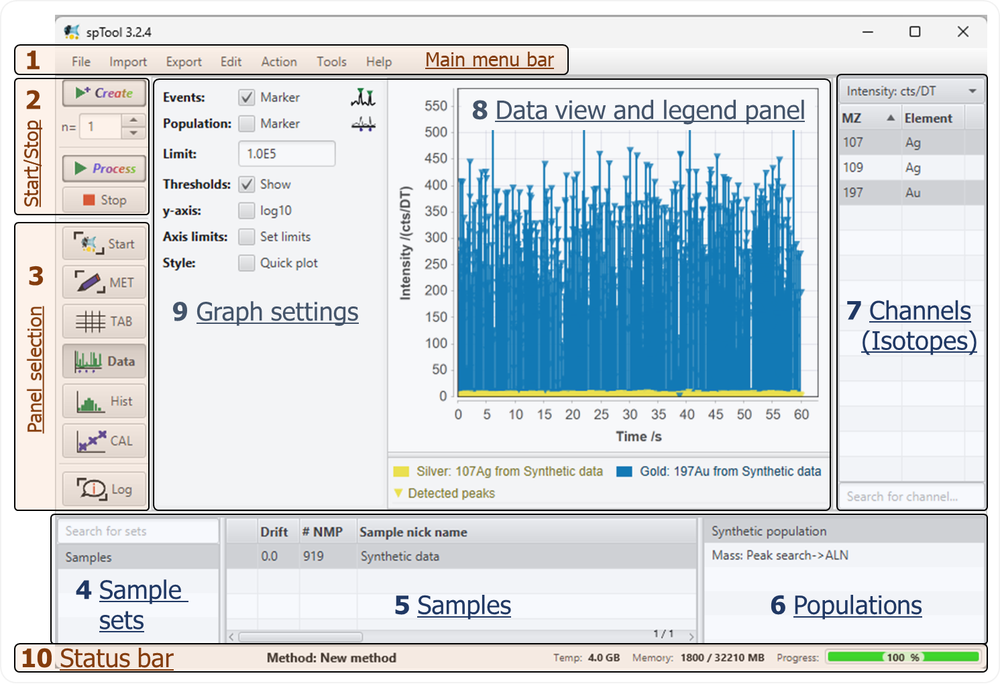{: width="500" }

## 1 Main menu bar

- **1.1 File**:
    - `Save project as`: Saves all sample sets with their samples, including imported raw data, processed particle data,
      quantification and method, to the drive.
        - Note: For ICP-TOFMS data, this does not save those isotopes that have not
          been loaded. If you move the raw data files, reprocessing of the data may cause issues (see
          `Check sample files`).
        - Note: The project does not save the current method in the method editor. Use the method editor to save and
          organise your method files. Alternatively, each sample contains a copy of the method that it has been
          processes with, and you can load the method from the sample after loading the project in the future with
          `Open project`.
    - `Open project`: Load a project.
    - `Save appearance`: Saves all settings affecting the user interface and plots. This includes:
        - All graph settings shown in `panel 9`
        - Positions of dividers between user interface elements
        - Positions of popup views of the data view and legend panels (`panel 8`)
    - `Reset appearance`: Resets settings affecting the user interface and plots (see `Save appearance`).
    - `Check sample files`: Starts a lookup whether the raw data files of the current samples can still be found on the
      computer. Else, it allows you to set a new drive location to search for the data and match them to the samples.
      Why are the raw data needed? For ICP-TOFMS data processing, some calculations require access to the raw data. This
      includes:
        - Showing the spectra of all m/z (isotopes)
        - Cluster analysis based on all m/z (isotopes)

- **1.2 Import**:
    - `Select files`: Select files that are in the *default import path* which can be set in the configuration (`Edit` >
      `Configuration` > `Import path`). This opens the **'List files' dialog**:

      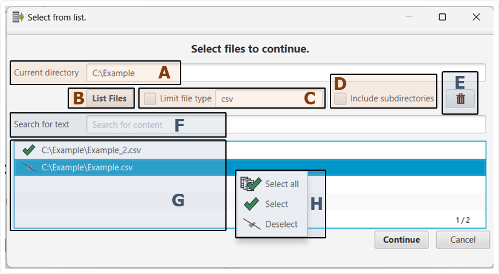{: width="400" }

        - **A**: Enter a path (folder) where your data is. Use copy/paste or manually enter a
          valid path. Alternatively use the **right-click menu** to open a file browser to set a directory.
        - **B**: Click this button to list the files in the directory.
        - **C**: Select this checkbox and specify a type (e.g., 'csv') if you only wish to be shown files of a certain
          type. Note: This checkbox also affects the drag/drop import of files into the main window of spTool.
        - **D**: Select this checkbox if you want to browse subdirectories, too. You can set the depth, i.e., how many
          levels will be browsed in the configuration: `Edit` > `Configuration` > `Subdirectory import depth`. Note:
          This checkbox also affects the drag/drop import of files into the main window of spTool.
        - **E**: Clear the list of files below.
        - **F**: Enter keywords to filter the list of files shown below in `panel G`.
        - **G**: This is the list of files. When you enter a keyword in the search field in `panel G`, only a subset of
          the files is shown that matches the search. This list has special features:
            - You can drag/drop files and folders here from the file browser on your system, e.g., Windows
              explorer. For drag/dropping directories, you can set the depth, i.e., how many levels will be browsed in
              the configuration: `Edit` > `Configuration` > `Subdirectory import depth`.
            - You can select files by clicking on them. Hold `Control` or `Shift` key to select individual files or a
              series of files, respectively. Double click selects all files. **Special case:** If you want to use the
              search function and select multiple files for different keywords, you can use the right click menu shown
              in `panel H`.
        - **H**: Selection menu: You can mark files in the list as **selected** using this menu. Intended usage: You
          browse a folder with multiple files but only want to import a subset. Enter a search keyword in `panel F`,
          e.g., 'Au NP'. Next, right-click on the desired files in `panel G` and click 'Select' in the popup menu that
          opens (`panel H`). Now you can change search key word and repeat the process.
        - Finally, click the 'Continue' button or `Control` + `Enter` to continue.
    - `Browse`: Opens a file browser popup to select a folder for import. Next, the **'List files' dialog** is shown. (
      see above for `Select files`). Click the 'List files' button or use the options as described above for
      `Select files`.
    - `Recent folders`: This opens a popup list with locations (folders) that have been used for imports recently.
        - Click the 'Continue' button or **double-click** on a folder to directly proceed to the
          **'List files' dialog**.
        - Right-click a folder to mark it as favorite or delete it.
        - Use the bin icon (top) to clear the list.
        - Use the save icon (top) to save changes (e.g., deletions or highlighting).
        - If a warning symbol (yellow triangle with exclamation mark) is shown in front of a folder, the path does not
          exist anymore on your system.
    - `Recent files`: This opens a popup list with sets of files that have been imported recently.
        - Click the 'Continue' button proceed to the **'List files' dialog**.
        - **Right-click** on an entry to mark it as a favorite or delete it.
        - Use the bin symbol at the top to clear the entire list.
        - Use the save symbol at the top to save changes (e.g., deletions or highlighting).
        - Use the **right-click** option **View content** to see which files the entry includes.
        - Select an entry and press `F2` or **left-click** on it again, or **double-click** on an entry.

- **1.3 Export**:
    - `Show dialog`: Opens the export dialog. A brief overview of its most important features:
        - `Format`: Decide if data is copied to clipboard or written as a csv file. Note: If your export would be
          written as several csv files, you should not use the clipboard option.
        - `Export path`: If 'csv file' is selected, you can set the folder where files are written. Use the
          **right-click menu** to open a file browser to set a directory.
        - `Export raw data` button: Exports the raw data as time-resolved intensity data. You may add event markers (
          symbols that indicate the peak), population markers (symbols at the bottom that indicate which (in-silico)
          population an event belongs to) and tell spTool to only export the selected isotopes.

      **On the right side, there is a list of buttons that do not need further settings:**

        - `Export event data`: Exports data for each event including peak area.
        - `Export results table`: Exports the table from the `TAB` pane with key results and settings.
        - `Export method as ...`: Exports the current method either as a human-readable '.csv' file or an '.spm' file
          that can be loaded into spTool later.
        - ... to be completed ...

- **1.4 Edit**:
    - `Submethod editor`: Opens the editor to create, modify and organise submethods.
    - `Configuration`: Opens the configuration editor.

- **1.5 Action**:
    - `Increase dewll time`: Opens a submethod dialog to create a copy of each selected sample whose data is binned to
      the specified dwell time. This allows a rapid what-if exploration to see what the data would look like at larger
      dwell times.
    - `Cut time region`: Opens a submethod dialog to set limits on the time series, e.g., only use data from 20 s to 30
      s.
    - `Select event data range`: Opens a submethod dialog to set limits on the event data. This operation is the same as
      selecting a region-of-interest (ROI). This is a lightweight version of the ROI submethod.
    - `Compute isotope ratio`: Opens a submethod dialog to compute isotope ratios. For all selected samples, the ratio
      of the first two selected isotopes is computed. The division is in order, i.e., divide first selected isotope by
      second selected isotope. Use the 'Invert' checkbox in the dialog to invert the order, i.e., divide second by first
      selected isotope.

- **1.6 Tools**:
    - `z/alpha converter`: Opens a popup to convert between the one-sided alpha error (Type I error probability) and the
      corresponding z-factor (as in z·σ) used to calculate a critical limit. Example: z = 1.645 --> α = 5%.
    - `Abundance calculator`: For the synthetic data generator: In the submethod, you have to enter the signal for each
      element (not per isotope). This calculator helps you determine which 'total signal' to specify in the submethod in
      order to achieve a certain isotope signal. For example: In the field 'Isotope', type 13C. For 'Isotope signal',
      enter 100. The popup tells you that the 'Total signal' for C must be 9345.8 cts to obtain 100 cts for 13C.
    - `Isotope search`: A lightweight search window to find isotopes. Enter an element symbol (e.g., Gd) and get a list
      of all its isotopes. Enter a number (e.g., 156) and get a list of all elements with such isotope. You may also
      enter an 'interfering mass shift' (such as 16 for oxides) and include 'Doubly charged' ions as well as 'Dimers'.
      The report looks like this:

    - 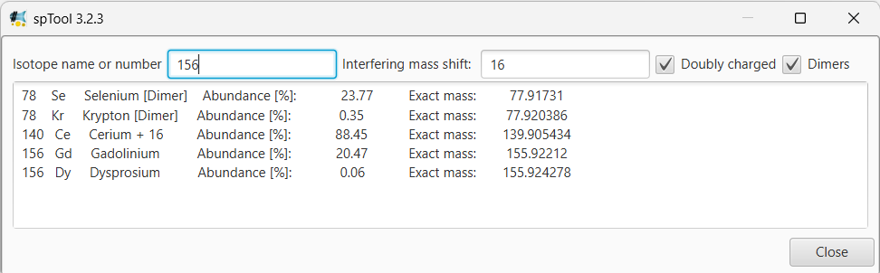{: width="500" }
    - `Interference library`: Search the interference database by Madeleine C. Lomax-Vogt, Fang Liu, John W.
      Olesik at [https://doi.org/10.1016/j.sab.2021.106098](https://doi.org/10.1016/j.sab.2021.106098)
    - `List isobars`: Lists isobaric isotopes to plan in-silico experiments or interpret experimental data.
    - `Significance test`: Quickly test results for statistical significance. Note: This feature is still under
      validation. It is recommended to verify results against established statistical libraries, such as those provided
      in the R environment.
    - `Estimate a- and b-error`: Compare in-silico data with data processing results to benchmark the data processing
      algorithm and settings.

- **1.7 Help**:
    - `About`

## 2 Start/stop section

- `Create`: If your method contains in-silico data generator submethods to create synthetic data, this button will 1)
  execute the data generation and 2) run data analysis submethods (baseline, event search, ...) if available.
- Use the n = ... field to create replicates by executing the same method multiple times.
- `Process`: This button skips all data generator submethods and only executes the analysis submethods (baseline, event
  search, ...). Use this button if you would like to reprocess synthetic data or for experimental data.
- `Stop`: Tries to stop the current operation if possible.

## 3 Panel selection

Decide which panel is shown. Use right-click to open multiple panels as popup windows. You can decide which panels to
show in the configuration: `Edit` > `Configuration` > `Show ...`.

## 4 Sample set list

Organise samples in sets. Use the **right-click menu** to `Create` or `Delete` sets. Populate sets by dragging/dropping
selected samples from `panel 5` into sample sets. Hold control key to copy and shift key to cut. Use the text field at
the top to filter the sets that are shown for a keyword.

## 5 Sample table

This table shows all samples within the currently selected set. Double click selects all samples. You can edit the
nickname with the `F2` key or by left-clicking on the nickname cell of a selected sample. You can also edit the comment
cell in the same way. `# NMP` gives the average number of nano/microparticles of the sample for the currently selected
channels (`panel 7`) and population (`panel 6`). The sample table has an extensive **right-click menu**:

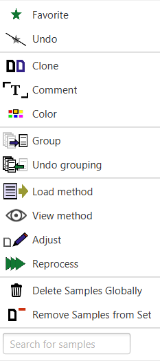{: width="150" }

- `Favorite`/`Undo`: Highlight selected samples as a favorite. The sample table `panel 5` can be sorted by the highlight
  property which is shown via a star symbol in the first column.
- `Clone`: create a copy of the sample, e.g., to compare different processing settings.
- `Comment`: Edit the comment of a sample in a convenient popup text editor. You can also edit the comment in the table
  column itself. If multiple samples are selected this will only affect the first of them.
- `Color`: Select the color of the selected sample. If multiple samples are selected this will only affect the first of
  them.
- `Load method`: Overwrites the current method which is shown in the `MET` tab in the selection area `panel 3` by
  loading the method that has been used to process the currently selected sample. If multiple samples are selected the
  first will be used.
- `View method`: Opens a popup window to view the method that was used to process the currently selected sample in a
  read-only mode. If multiple samples are selected the first will be used.
- `Adjust`: Opens a popup window to edit the method of the (first) currently selected sample and to reprocess it. You
  can also use this to change the isotopes that have been loaded from raw data during import by changing the selected
  isotopes and clicking `Update m/z`; this will keep the existing sample including quantification, nickname,
  comments, ... and only update the set of imported isotopes. Alternatively, you can import the raw data again as a new
  sample using `Import copy` or replace the sample entirely by re-loading the data using `Replace`.

  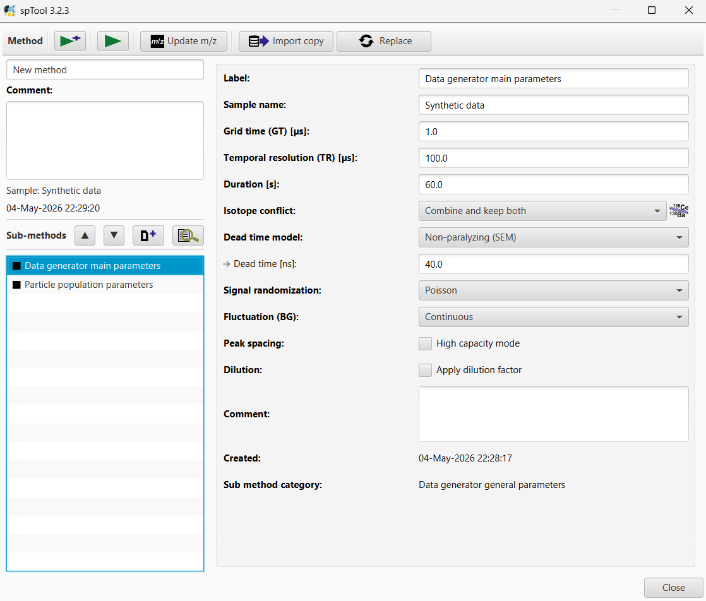{: width="550" }

- `Reprocess`: Reprocess the selected samples. When you process a sample, a copy of the method that was used for
  processing is stored in the sample. This button triggers reprocessing using the method that was previously stored with
  the sample. This option can help to, reprocess a sample after manually removing isotopes or to quickly update samples
  when the algorithms have received updates without changing the submethod parameters.
- `Delete Samples Globally`: Deletes the selected samples from all sets. This is the 'delete' behaviour that will
  permanently remove a sample from the project.
- `Remove Samples from Set`: Removes the selected samples from the currently selected set in `panel 4`. If a sample
  exists in other sets, it will stay there.

**Further features of the sample table**:

- You can drag/drop selected samples from `panel 5` into sample sets. Hold control key to copy and shift key to cut.
- `Group`/`Undo grouping`: Merge multiple sample files into a single combined sample. This feature serves to merge
  individual sample files into one combined sample.

## 6 Population list

spTool structures events into populations. Typical populations are:

- 'Synthetic population': These are all events that have been generated by the in-silico data generator.
- 'Mass: Peak search': These are all events that have been found by a 'Peak search'. 'Mass' is a tag that can be set in
  the search submethod.

The **right-click menu** has additional options:

- `Lock`: If a population is locked, it will always remain selected. If a sample does not have a specific population, a
  warning symbol will be shown to indicate that this population does not exist, and it will not be shown in any graph or
  table.
- `Unlock`: Unlocks a population.
- `Delete`: Deletes a population from all selected samples.
- `View mz`: For aligned populations, this button opens a list with all contributing isotopes.

## 7 Channel (Isotope) table

Select channels (i.e., m/z or isotopes). At the top, the dropdown menu decides if histograms and other graphs show the
raw intensity in counts (cts) or size and mass units if quantification is provided.

The **right-click menu** has additional options:

- `Default`: Selects the default isotopes for each element. The 'default' usually is the most abundant isotope but this
  can be set in the configuration:  `Edit` > `Configuration` > `Default isotope`. Double-clicking on the table has the
  same effect.
- `Select all`: Does what it says.
- `Fix isotopes`: Opens a periodic table popup view. For the selected sample, you can specify a 'fixed' set of isotopes
  that are different from the `Default` option. Use `Control` key and a double click on the table to select the 'fixed'
  isotopes.
- `Color`: Assign a custom color to a channel. This can also be edited at `Edit` > `Configuration` > `Isotope color`.
  Note: In order to save the changes that you make via the channel table in `panel 7`, you must open the configuration
  editor `Edit` > `Configuration` and save it (either via the symbol at the top left or the 'Save & close' button).
- `Delete isotopes`: Permanently removes the selected isotopes from the selected samples. Note: Results from processing,
  e.g., combined significance will not be deleted retrospectively. It is recommended to reprocess the samples, either
  using the right click `Reprocess` menu button from `panel 5` (use this if each sample has its own method parameters)
  or the main `Process` button in `panel 2` (use this if all samples share the same method parameters).

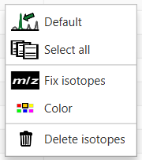{: width="125" }

## 8 Data view and legend panel

Shows the `Start` page, the `MET` method editor and **all graphs**. Use `panel 3` to decide which type of graph is
shown. Use the right click menu of the graph area to export the data as csv, copy data to clipboard, save the graphic as
a file or copy the graph to clipboard as an image. Legend and graph are rendered in different ways which is why they are
written into 2 distinct files.

- **Plot Navigation** (see `start` panel)
    - **Go back to previous view**: `Control` + `Z`
    - **Reset graph entirely**: Click left mouse and drag up
- **Move the plot**
    - Option A: `Alt` + 1× left mouse click, then move the mouse
    - Option B: 2× left mouse click, then drag the mouse
- **Zoom**
    - Option A: Scroll wheel → zoom both x and y axes
    - Option B: Scroll wheel + `Control` → zoom x-axis
    - Option C: Scroll wheel + `Alt` → zoom y-axis
- **Arrow keys** (click on the plot to activate arrow navigation)
    - Arrow keys (Left/Right/Up/Down): Move the plot
    - `Control` + `Left/Right`: Zoom in/out for x axis
    - `Control` + `Up/Down`: Zoom in/out for y axis
- **Dragging zoom**
    - `Control` + `Right mouse`: Zoom x axis by dragging
    - `Shift` + `Left mouse`: Zoom y axis by dragging
- **Transfer values from plots**
    - Double left-click on a graph to copy current mouse position
    - Certain text fields in the user interface accept values when double clicking on the text field while pressing the
      `Control` key

## 9 Graph settings

Each graph has its own set of settings. **Most importantly**, histograms, box plots, scatter plots, ... allow you to
select which **event parameter** you would like to visualise. Take a look at this example from the histogram panel:

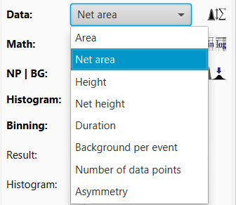{: width="225" }

- `Area`: Shows the peak 'area' (actually the sum of all data points that form the event). No background subtraction is
  applied.
- `Net area`: Shows the net peak 'area', i.e., remaining peak area after background subtraction. This is the event
  parameter that you would usually want to use for quantification.
  Take a look at the 'Search' submethod's options: Here you can decide how background is computed.
- `Height`: Shows the intensity value of the highest data point of the peak.
- `Net height`: Shows the intensity value of the highest data point of the peak minus the background signal. For
  example,
  if the background is estimated via the mean of the baseline (see 'Search' submethod), then the net is `height - mean
  baseline signal`.
- `Duration`: Duration of the peak (from first to last data point, i.e., peak width at base) in µs.
- `Background per event`: In the 'Search' submethod you can decide how background is computed. This option allows you
  to plot the background signal that was determined for each event. The background per event specifies the estimated
  summed background signal for the whole peak (not per data point)! Thus, for a constant baseline, wider peaks will have
  more 'background per event' than thin peaks.
- `Number of data points`: Width of the peak (from first to last data point, i.e., peak width at base) in number of data
  points.
- `Asymmetry`: Event peak asymmetry is computed as `2b / (a+b)`, where `a` is the distance from start to apex and `b` is
  the
  distance from apex to end. It is equal to `1` when `a = b`, and increases as `b` becomes more pronounced relative to
  `a`.

---

# 2. First step: *create a method*

Data generation and analysis in spTool are structured into methods and submethods. Method files (.spm files) can be
saved, shared and reloaded. You can also drag & drop an .spm file into spTool to load it. By default, method files are
kept in the user folder: (typically: `C:\Users\USERNAME\spTool3\user\methods`). *You can share these files with
collaborators or include them in a publication's supplementary data to make harmonisation and comparison of analysis
strategies easier*.

To create a method, navigate to `panel 3` and select `MET`. This puts the method editor in the centre view of the
window. A method contains submethods with instructions for each processing step. A detailed list of these steps is
provided
below. For a quick start, click on the central `Quick start new method` button to create a new method.

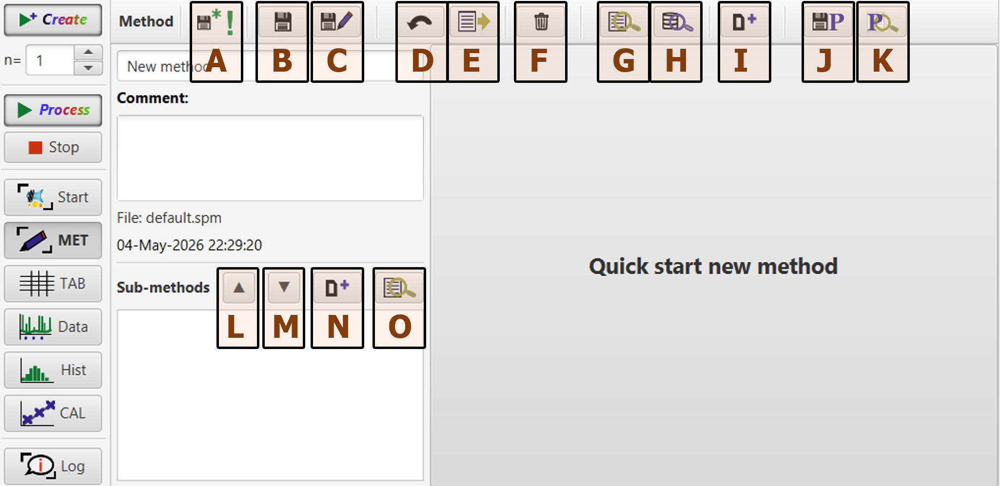{: width="600" }

- **A**: Symbol indicates if the method has changed since the last time you saved it.
- **B**: `Save`: Overwrites the file that the method has been saved as.
- **C**: `Save as`: Opens a file explorer window to let you save the method as a new file. This keeps the previous file
  unaltered.
- **D**: Resets the method to the state of the last time it was saved.
- **E**: Reloads the 'default' method. You can set a default method in the configuration via `Edit` > `Configuration` >
  `Current method`.
- **F**: `Delete`: Deletes the current method file by moving it into the 'recycle' folder in your user directory (
  typically: `C:\Users\USERNAME\spTool3\user\methods_recycled`).
- **G**: Open a popup window to quickly find and load a method from your user directory (typically:
  `C:\Users\USERNAME\spTool3\user\methods`). The user directory serves as a storage place for your methods. When
  downloading a new version of spTool, it will find existing methods automatically. Hint: The **right click menu**
  offers additional features:
    - delete method (see **F**)
    - add highlights as a bookmark.
- **H**: Alternatively to the library popup (**G**), you can open a file browser to load method files.
- **I**: Creates a new method.
- **J**: Save the current method into the current project folder. You can set the current project directory via `Edit` >
  `Configuration` > `Project path`. The project directory is the location on your system where spTool will try to store
  and load projects (see explanation on the `File` menu in section 1.1). If your method is highly specific to a certain
  project,
  you can use this button to save it in the same folder.
- **K**: Loads a method from the current project folder. You can set the current project directory via `Edit` >
  `Configuration` > `Project path`. The project directory is the location on your system where spTool will try to store
  and load projects (see explanation on the `File` menu in section 1.1).
- **L**: Submethods are executed in the order that they are listed. Use this button to move a submethod **up**.
- **M**: Submethods are executed in the order that they are listed. Use this button to move a submethod **down**.
- **N**: Creates a new submethod.
- **O**: Add an existing submethod from the submethod library (see `Edit` > `Submethod editor`).
- Use the **right click menu** to further organise submethods:  
  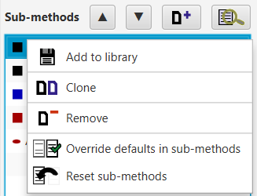{: width="200" }
    - `Add to library`: Adds the selected submethods to the submethod library (see `Edit` > `Submethod library`).
    - `Clone`: Creates and adds a copy of the selected submethod.
    - `Remove`: Removes the selected submethods from the method.
    - `Override defaults in submethods`/`Reset submethods`: You can set a 'default' state of your submethod via
      `Override defaults in submethods`. When you click on it, the submethod sets its current settings as its default.
      Use `Reset submethods` to reset the selected submethods to the default settings. This can be helpful when you try
      to optimise a method and vary parameters frequently. Alternatively, you can use button **D** to reset the whole
      method to its 'last saved' settings.

## 2.1 Available submethods:

**To see all options in the submethods, make sure to activate the 'Expert mode' via `Edit` >
`Configuration` > `Expert mode`.** Else, you will be shown the lightweight version that only lists the most important
options. In the background, the non-expert options are applied during processing with the respective value that is set
in the submethod!

- `Csv import parameters`: Define how csv files are read. Note: spTool will use this submethod if you tell it to do so
  in the configuration: `Edit` > `Configuration` > `Import submethod` or else it will prompt you to input the import
  parameters with each new import.

- `Nu import parameters`: Define how Nu TOF data are read. Here you can also select which isotopes to load. Note: spTool
  will use this submethod if you tell it to do so in the configuration: `Edit` > `Configuration` > `Import submethod` or
  else it will prompt you to input the import parameters with each new import.

- `Data generator main parameters`: This submethod is required to generate in-silico data. It contains parameters that
  describe the 'synthetic' sample (see *spTool: An interactive software to generate and navigate in-silico single
  particle data from ICP-QMS and ICP-TOFMS instruments*
  [https://doi.org/10.26434/chemrxiv.15004857/v1](https://doi.org/10.26434/chemrxiv.15004857/v1))

- `Particle population parameters`: At least one instance of this submethod is required to generate in-silico data. It
  contains parameters that describe an in-silico particle population (see *spTool: An interactive software to
  generate and navigate in-silico single particle data from ICP-QMS and ICP-TOFMS
  instruments*  [https://doi.org/10.26434/chemrxiv.15004857/v1](https://doi.org/10.26434/chemrxiv.15004857/v1))

- `Signal modification parameters`: Submethod for mathematical modification of signal, e.g., sum the signal of all
  isotopes of an element.

- `Time region`: Submethod to select a time region of the sample (or to reset the sample to its original full time
  range).

- `Baseline parameters`: **This submethod is required for analysis**. It tells spTool how to estimate the baseline. The
  baseline is a statistical model of the background signal. Note: *This method does not set the threshold!* *The
  baseline must be calculated before starting an event search!*

- `Search parameters`: This submethod tells spTool how to search for events. *This method controls the detection
  threshold* (see `highlight box A` below). It uses the statistical model of the background provided by the baseline.
  For the detection threshold (i.e., the `Event height filter`), you can set the one-sided alpha error (Type I error
  probability) as α (`highlight box A`: typically 1E-6) or via the corresponding z-factor (as in z·σ, `highlight box B`:
  typically z = 3.29).

  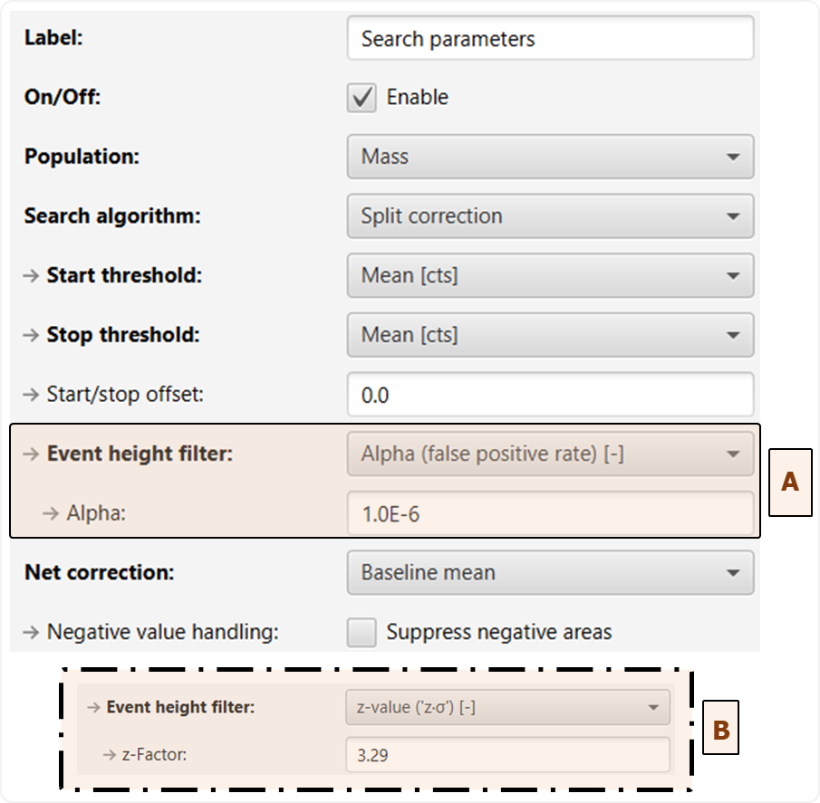{: width="350" }

  Hint: Each search submethod creates a new population. You can add more than one search submethod with different
  parameters, e.g., optimised to get the best data on particle number and particle size. For that, each search
  submethod creates a new branch. All subsequent operations, e.g., Gating, Filters and Align, are applied to that
  branch. When you add a new search submethod, you start a new branch and the previous Gating, Filter, ... submethods do
  not apply to the new branch (i.e., you have to add them).

  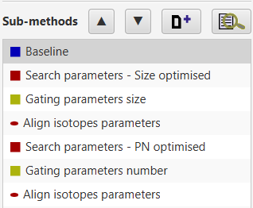{: width="215" }

- `Align isotopes parameters`: For TOFMS data, this method is used to align events across multiple channels (mz,
  isotopes). **Typically, this method is required for composition analysis unless the search handles alignment by
  itself!** **Note: Once the isotopes are aligned, you cannot use Gating or any Filter other than 'Aligned filtering'.
  Thus, it is recommended to filter the data properly first and then align.**

- `Gating parameters`: This submethod includes options to remove events based on certain peak properties such as 'Number
  of points', 'Area', 'Height'.

  **Note: The peak height-based gating filter is somewhat redundant with the search height
  specified in the search method. Why does spTool provide two options?** The idea is that the search submethod assumes
  *sane statistical conditions*, i.e., the background signal is well described by the statistical model, e.g., a
  Gaussian or Poisson distribution. This assumption can, however, quickly be violated. Example: When there is small
  particulate contamination, the baseline may not purely consist of 'ionic' species. Especially for the Poisson
  distribution, which does not take the empirical standard deviation into account but only the mean ionic signal, such
  presence of 'unknown particulate dirt' will likely render the critical limit estimation rather unreliable. As
  described in the 2023 JAAS paper [https://doi.org/10.1039/d3ja00292f](https://doi.org/10.1039/d3ja00292f), this
  mismatch between statistical model and
  reality often manifests in an excess of false-positive event detections. In response, researchers tend to increase the
  threshold by choosing extremely high z-values with z > 5 (z as in z·σ, i.e., 5·σ). However, these large z-values are
  not really justified from the statistical point of view: They rather indicate that the statistical model does not
  match the experimental data very well. Instead, the 2023 JAAS paper proposes a different approach where the detection
  limit (according to Currie's formalisms) is multiplied with a factor (typically f=2) to avoid 'ridiculous' z-factors
  beyond z=5. The Gating submethod allows this procedure, which is not based on pure statistics but represents a solid
  numerical approximation.
  **Keep in mind that this approach is rather a 'last resort' measure**:

  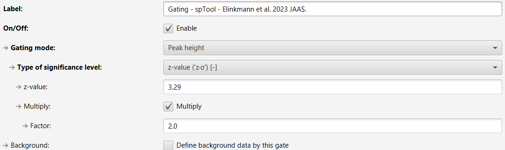{: width="650" }

- `Filter parameters`: The filter submethod provides further options to remove events, e.g., peak coincidence as
  described in Elinkmann and Kronenberg et al.
  [https://doi.org/10.1016/j.talanta.2026.129835](https://doi.org/10.1016/j.talanta.2026.129835) or over-range
  events, and 'regions of interest' (ROI) in the intensity data.

- `Remove isotopes parameters`: This submethod allows you to remove isotopes with too few or too many events or too
  little intensity. Consider putting this submethod before the `Align isotopes parameters` submethod to keep 'bad
  isotopes' out of subsequent cluster analyses.

****
***Find the latest release on [github](https://github.com/melinkmann/spTool3-release/releases/latest)!*** 